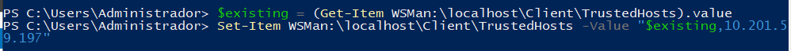
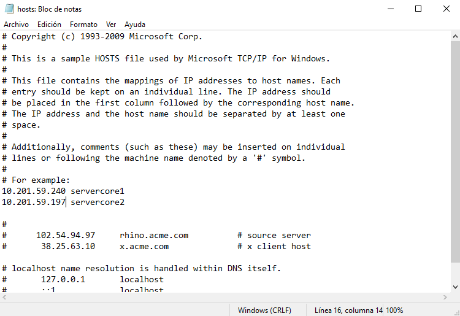
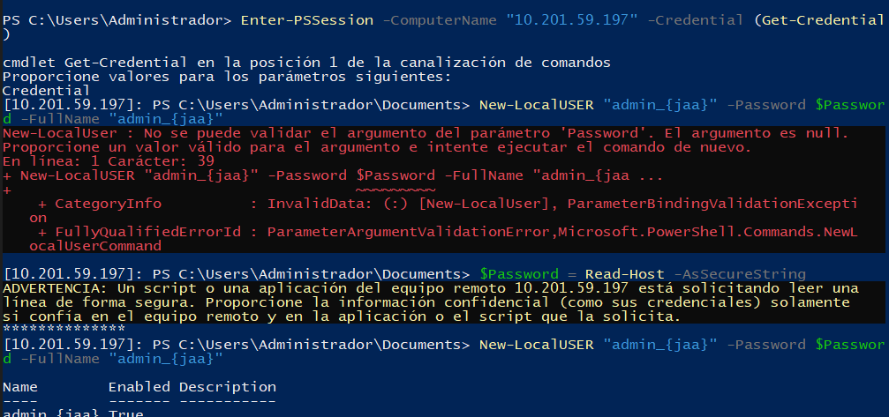
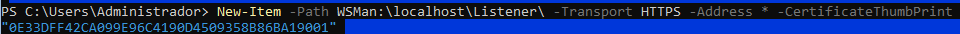

## practica 201
para conectar los cores al windows srver con entorno gráfico lo primero que tnemos qu hacer al encender el core es utilizar powershell, poniendo powershell en el cli.
luego teines que condifugrar el internet de la maquina usando el comando sconfig. despues de eso teines que configurar el firewall para poder acceder desde feura al core con los siguientes comandos : 

Luego tenemos que añadir los core mediante ip al server que si tiene entorno gráfico a la lista de tsuted host que se hace con el siguiente comando (como tenemos que añadir dos usare el de añadir un equipo en vez de meter uno y borrar los demás equipos de la lista):

para la resolución de nombres tienes que ir a la archivo hosts que se encuentra en la ruta: C:\Windows\System32\Drivers\etc\Hosts. y pones lo sigueinte

primero nos conectamso a la maquina y luego creamos le usuarios cocn los siguientes comandos

el siguiente paso e asegurar la conexión mediane htps que se hara con los siguieguientes comandos desde el core ( tenemos que crear un certificado para poder usar https y tenemos que mandarlo al equipo desde el que vamos a acceder al core para eso usaremos una carpeta compartida entre las doss maquinas virtuales, luego tenemos que quitar el puerto de http y dejar solo el de https)

