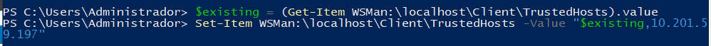
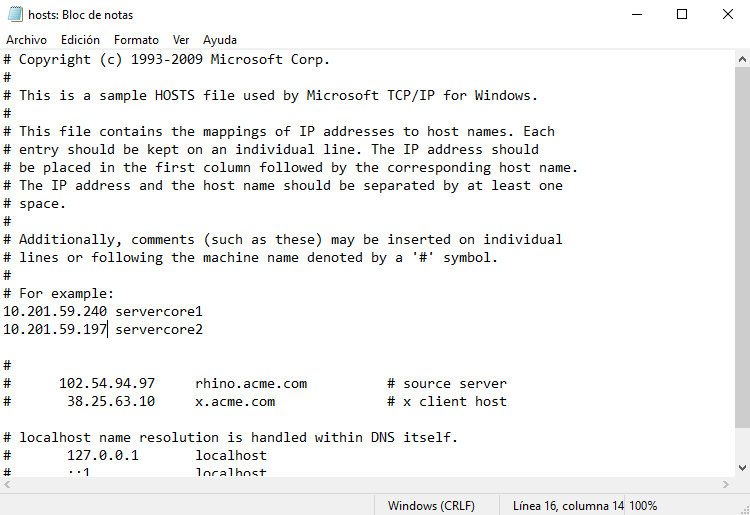
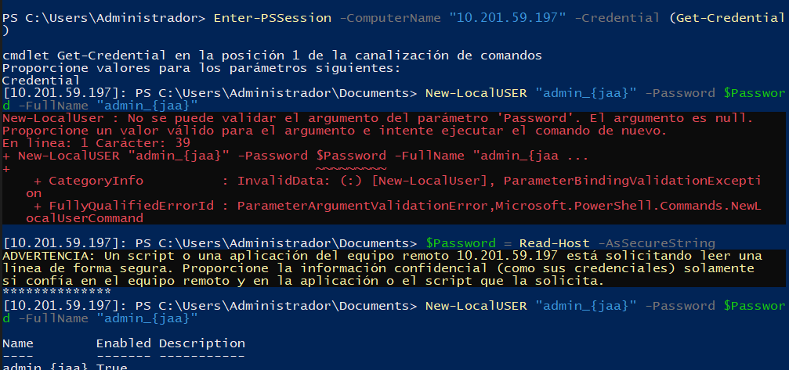
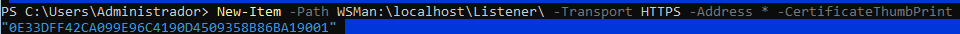
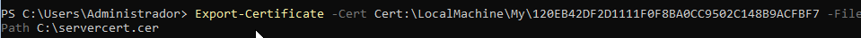
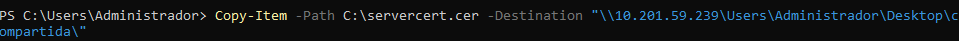

## Práctica 201
Para conectar los cores al windows srver con entorno gráfico lo primero que tenemos que hacer al encender el core es utilizar powershell, poniendo powershell en el cli.
luego tienes que configurar el internet de la maquina usando el comando sconfig. despues de eso tiines que configurar el firewall para poder acceder desde fuera al core con los siguientes comandos : 

Luego tenemos que añadir los core mediante ip al server que si tiene entorno gráfico a la lista de trusted host que se hace con el siguiente comando (como tenemos que añadir dos usare el de añadir un equipo en vez de meter uno y borrar los demás equipos de la lista):

Para la resolución de nombres tienes que ir a la archivo hosts que se encuentra en la ruta: C:\Windows\System32\Drivers\etc\Hosts. y pones lo siguiente

primero nos conectamos a la maquina y luego creamos le usuarios cocn los siguientes comandos

El siguiente paso e asegurar la conexión mediante https que se hará con los siguientes comandos desde el core ( tenemos que crear un certificado para poder usar https y tenemos que mandarlo al equipo desde el que vamos a acceder al core para eso usaremos una carpeta compartida entre las dos maquinas virtuales, luego tenemos que quitar el puerto de http y dejar solo el de https)

